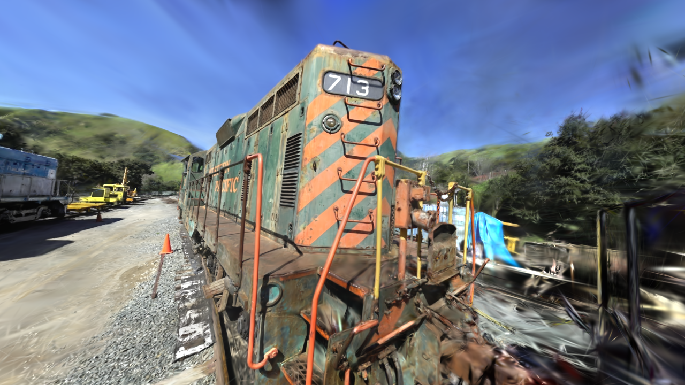

# 3D Gaussian Splatting

A Vulkan renderer for 3D Gaussian Splatting (original paper: https://repo-sam.inria.fr/fungraph/3d-gaussian-splatting/3d_gaussian_splatting_low.pdf). It works by first importing 3D gaussians from a given .ply-file (not included in this repository) on application startup. The renderer then sorts, projects, rasterizes and blends gaussians in real-time. A GPU-driven approach is being used and relies only on compute shaders, rather than utilizing the graphics pipeline. Still, a number of optimizations needed to be implemented in order for the application to achieve high performance.

# Optimizations
Implemented optimizations which were proposed by the original paper:
* Interleaving loading and rendering of gaussians to increase throughput of both bandwidth and arithmetic operations
* Tiled shading
* Frustum culling

Optimizations from my own experimentation:
* Utilizing GPU-based radix sort rather than bitonic merge sort (there is still lots of room for improving the sorting implementation)
* Indirect dispatches, to sort only the necessary number of gaussians per screen space tile
* Subgroups, to share limited data and operations among threads
* Ordering gaussians in the GPU buffer according to a Z-order curve w.r.t. 3D position, to increase cache coherency

# Pipeline

The pipeline for rendering one frame is comprised of 9 compute shaders:
1. "InitSortList": Adds one element per gaussian per overlapping tile into the list to be sorted. A 64-bit key and a 32-bit payload make up an element for sorting. The key is using the higher 32-bits for tile ID and lower 32-bits for view space depth, while the payload contains a gaussian ID.
2. "IndirectSetup": Computes the number of work groups for the various indirect radix sort shader dispatches.
3. "Count": Counts the number of 4-bit masked keys and stores the sum in a sum table.
4. "Reduce": Uses the sum table to sum values within a work group, and stores the result in a reduce buffer.
5. "Scan": Computes the exclusive prefix sum over the reduce buffer.
6. "ScanAdd": Uses the reduce buffer to compute the exclusive prefix sum over the sum table.
7. "Scatter": Uses the sum table to reorder keys and payloads.
8. "FindRanges": Computes start and end indices of gaussians within the same tile.
9. "RenderGaussians": Blends gaussians and writes output colors to the swapchain image.

The radix sort implementation is based on [AMD FidelityFX Parallel Sort](https://github.com/GPUOpen-LibrariesAndSDKs/FidelityFX-SDK/blob/main/docs/samples/parallel-sort.md) and consists of 5 shaders. One pass of executing these 5 shaders results in 4 bits being sorted (due to memory constraints). These shaders are therefore executed in N number of passes within one rendering frame to sort the full 64-bit keys.

The main difference between this implementation and AMD FidelityFX, is that this application do not impose a strong upper limit on the number of work groups being computed based on the number of elements to sort. This heavily simplifies the code and in theory allows Count, Reduce, ScanAdd and Scatter to scale better for high-end GPUs. A potential drawback is that it most likely slows down Scan. The performance of this implementation has not been tested against AMD FidelityFX.

# Benchmarks

* GPU: NVIDIA RTX 3080 Ti
* GPU Driver Version: 555.85
* Vulkan Version: 1.3.268
* OS: Windows 11 Home 23H2 (22631.3593)

## Garden

### 7'000 iterations: 4'386'142 gaussians
| GPU pass | 1280x720 | 1600x900 | 1920x1080 |
| :--- | :---:  | :---: | :---: |
| Elements To Sort | 0 | 0 | 0 |
| | | | |
| InitSortList | . ms | . ms | . ms |
| Radix Sort | . ms | . ms | . ms |
| FindRanges | . ms | . ms | . ms |
| RenderGaussians | . ms | . ms | . ms |
| Total Measured GPU Time | . ms | . ms | . ms |

### 30'000 iterations: 5'834'784 gaussians
| GPU pass | 1280x720 | 1600x900 | 1920x1080 |
| :--- | :---:  | :---: | :---: |
| Elements To Sort | 0 | 0 | 0 |
| | | | |
| InitSortList | . ms | . ms | . ms |
| Radix Sort | . ms | . ms | . ms |
| FindRanges | . ms | . ms | . ms |
| RenderGaussians | . ms | . ms | . ms |
| Total Measured GPU Time | . ms | . ms | . ms |

## Train

### 7'000 iterations: 559'263 gaussians
| GPU pass | 1280x720 | 1600x900 | 1920x1080 |
| :--- | :---:  | :---: | :---: |
| Elements To Sort | 0 | 0 | 0 |
| | | | |
| InitSortList | . ms | . ms | . ms |
| Radix Sort | . ms | . ms | . ms |
| FindRanges | . ms | . ms | . ms |
| RenderGaussians | . ms | . ms | . ms |
| Total Measured GPU Time | . ms | . ms | . ms |

### 30'000 iterations: 1'026'508 gaussians
| GPU pass | 1280x720 | 1600x900 | 1920x1080 |
| :--- | :---:  | :---: | :---: |
| Elements To Sort | 0 | 0 | 0 |
| | | | |
| InitSortList | . ms | . ms | . ms |
| Radix Sort | . ms | . ms | . ms |
| FindRanges | . ms | . ms | . ms |
| RenderGaussians |  . ms | . ms | . ms |
| Total Measured GPU Time | . ms | . ms | . ms |

# Vulkan features used
* Version 1.3
* Synchronization 2
* Push descriptors
* 64-bit shader integers

# Assets used
* Pre-trained 3D gaussian models: https://github.com/graphdeco-inria/gaussian-splatting

# Libraries and APIs used
* EnTT: entity components system
* GLFW: window management
* GLM: vector and matrix math
* hapPLY: .ply importing
* Vulkan: graphics and GPU management
* Vulkan Memory allocator: GPU memory management
